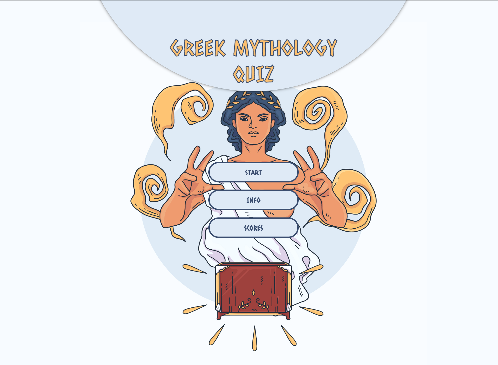

# **Greek Mythology Quiz**

[Link to live Website](https://mariamar95.github.io/Greek-Mythology-Quiz/)
 
 
This Website created as part of my Level 5 Web App Develomplent with Code Institude. 
## Project Goals: 
Create a Quiz Game responsive on smartphones, tablets, desktops and laptops where players can test their knowledge in Greek Mythology.
 

----
# **User Experience (UX)**
   - ##  **User stories**
     - Users can find information on how to play the game
     - Users can play the Quiz
     - Users can test their knowledge in Greek Mythology 
     - Users can submit their scores and compete with other players

  - ##  **Design**
    -  **Colour Scheme:**
       All the colours used on the website were sourced from the illustration that is used on the background of the quiz. 
         - **#F7FBFF** : Off-white used to as background. Covers the parts that the illustration does not cover. 
         - **#DEEAF6**: Light blue, used as background colour on some parts of the page like buttons and heading. 
         - **#394C70**: Dark blue, used for text and border.  
         - **#FEC26A**: Gold yellow, used on text and icons on the website.    
         
     -  **Typography:** The website used 2 fonts  
          - **Caesar Dressing**: Used for headings and titles. The font was chosen as it aligns with the website's style which is Greek Mythology.
          - **Magra** : Used for all the rest of the website such as questions and instractions. The Caesar Dressing Font can be hard to read on long pieces of text, that is when the Magra font is used instead.
          
     -   **Imagery** 
          - The illustation used on the background was sourced from [freepik](https://www.freepik.com/home)
             
          
  - ## **Wireframes-Mockups**
    - [Home Page](assets/images/Wirerames-Mockups/HomePage.jpeg)
    - [Quiz](assets/images/Wirerames-Mockups/Quiz.png)
    - [End of Quiz](assets/images/Wirerames-Mockups/EndOfQuiz.png)
    - [Scores](assets/images/Wirerames-Mockups/Scores.png)
    - [Info](assets/images/Wirerames-Mockups/Info.png)
--- 
# **Feautures**
 ## **Existing features**
 - ### Home Page
   - **Quiz Title:** Users can easily understad what the quiz is about
   - **Start Button:** Users can click on the quiz button and start the game
   - **Info Button:** Users can find information on how to play the game
   - **Score Button:** Users can find a leaderboard with the highest scores  
  - ### Quiz Page
    -  **Question:** Displayed at the top of the screen
    -  **Progress Bar:** Displayed at the top part of the screen and above the question. Users can tell what percentage of the quiz they have completed so far
    -  **Score:** Displayed at the top of the screen and next to the progress bar. Users start with 0 points and get 10 points for each correct question. The score is updated when the user selects the answer.
    -  **Answer Buttons:** Users can select their answer. If the answer is correct 10 points will be added on the score and the button will turn green. If the asnwer is wrong the button turns red. 
    -  **Timer:** Users have 10 seconds to select their answer. The timer starts as soon as the qustion appears on the screen. If no answer is selected when the timers goes off, the correct answer goes green.
  - ### End Page
    - **Final Score:** Displayed at the top of the screen. Users know what is the total number of points they collected during the game.
    - **Username Input & Save Button:** Users have the option to select a username and save their score
    - **Play Again Button:** Users have the option to restart the quiz for this page by clicking on the "Play Again" button.
    - **Home Button:** Redirects users to the home page
 - ### Info Page
   - This page includes instructions on how to play the game and a "BACK" button that takes users back to the home page.
 - ### Scores Page
    - This page includes a table with the top 5 scores and a button that takes you back to the home page.

## **Features left to implement in the future**
 - Add background music
 - Add sound effectes when when user selectes an answer (different sound for right and wrong answer).
 - Add 50-50 Help Button. Disables 2 of the 3 wrong answers. User has to select from 2 answers only.
 - ---
 # **Technologies used**
 -  **Languages Used**
    - HTML: Strature language
    - CSS: Style language 
    - JavaScript: Programming language
- **Gitpod:** Used to develop the project
- **Git:** Used to commit and push to GitHub
- **GitHub:** Used to host the project
- **GitHub Pages:** Used to deploy the project
- **Google Fonts:** Used for the fonts of the project
- **Figma:** Used to create mockups for the project
     
- ##  **Testing and Validation**
   - **W3C Markup Validation** Check whether there are any errors in the HTML code.
   - **Autoprefixer** Parses CSS and adds vendor prefixes
   - **W3C CSS Validator** Used to check if there were any errors in the CSS code.
   - **JShint** Used to check if there are any erros in JavaScript code.
  
---
# **Testing**
  - The testing process can be found [here](https://github.com/mariamar95/Greek-Mythology-Quiz/blob/main/TESTING.md).
   

---
# **Deployment**
## **GitHub Pages**
### The website is deployed using GitHub pages. It automatically updates new commits as they are pushed to the repository.

**How I deployed the website on GitHub Pages**
 1. Login to my GitHub account
 2. Open the 'Greek-Mythology-Quiz' repository
 3. Click on Settings
 4. Scroll down and click on the Pages tab located on the left of the screen
 5. Under 'Source' select the main branch
 6. Wait for the page to refresh
 7. Scroll down to and locate the website link under the 'GitHub Pages' section

**Cloning the repository**
 1. Open the repository
 2. Click the Code button above the list of files
 3. Click on GitHub CLI and click on the 'copy' button to copy the URL link
 4. Open GitPod
 5. Type 'git clone' and paste the URL link
 6. Find more [here](https://docs.github.com/en/repositories/creating-and-managing-repositories/cloning-a-repository#cloning-a-repository-to-github-desktop)
---
# **Credits**
- [freepik](https://www.freepik.com/)-Background Illustration 
- [Britannica](https://www.britannica.com/)-Quiz Questions and Answers 
- [Web Dev Simplified](https://www.youtube.com/c/WebDevSimplified)-Coding Videos
- [Brian Design](https://www.youtube.com/channel/UCsKsymTY_4BYR-wytLjex7A)-Coding Videos
