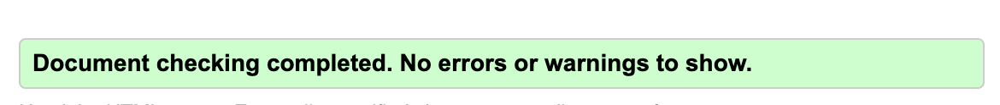
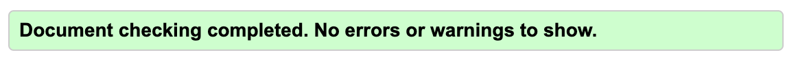
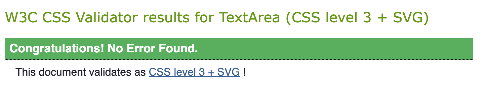
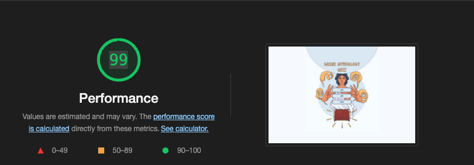

# **Testing**
## **Code Validators**
---

- [HTML Validator](https://validator.w3.org/): All errors and warnings correted. No errors found.
   - Home Page 
   - Quiz Page 
   - End Page 
   - Scores Page 

- [CSS Validator:](https://jigsaw.w3.org/css-validator/validator) No errors.
   - 
---
## **Performace**
---
- I have used [Lighthouse](https://developers.google.com/web/tools/lighthouse) to test the performace of the quiz. 
-  
---
## **Responsiveness**
---
To test the responsivness I have used [Chrome DevTools](https://developer.chrome.com/docs/devtools/) and the following devices.
  - MacBook Pro 15' (Laptop)
  - Xiaomi Readmi Note 10 (Mobile Phone)
  - Sony Experia (Mobile Phone)
  - Lenovo TAB-M10 (Tablet)
  - Dell Latitude 5410 (Laptop)
---
## **Browser Compatibility**
I have tested the website on the following browsers 
 - Google Chrome 
 - Safari 
 - Mozilla Firefox
 - Microsoft Edge 
  
The Quiz works well on all tested broswers

---
## **Testing User Stories**
---

- Users can find information on how to play the game
    - There is an "INFO" button located on the home page which directs you a different page where users can find information on how to play the game.
- Users can play the Quiz
   - All users can play the quiz by clicking on the "Start" button on the home page.
- Users can test their knowledge in Greek Mythology
  - All users can test their knowledge in Greek Mythology by playing the quiz. Feedback is given as soon as a user selects an answers. The button turns green if the answer is correct and turns red if the answer is wrong.
- Users can submit their scores and compete with other players
   - When users have answered all 5 questions, the quiz directs them to the end page. Their score is displayed on the top of their screen. They have the option to type in a username and save their score. When a user saves their score, the quiz directs them to the leaderboard page. The 5 highest scores are displayed ont his page. All users can access the score page from the home page as well.
  
---
## **Manual Testing & Bugs**
---
I have manually tested all the functions.
 
**Bugs**
- Using a smart device: When users select one of the answers, the button becomes bigger. When the next page loads the button selected from the previous answer is still bigger. This has not been fixed but it does not affect any other functions of the game. This bug only affects touch screen users.
- When deploying the project, the link that takes you to the score page from the end page did not work. When users would click to save their score a 404 error message would appear. This happened as I was using the file path instead of the file name. This issue is now resolved.

---
[README.md](https://github.com/mariamar95/Greek-Mythology-Quiz/blob/main/README.md)